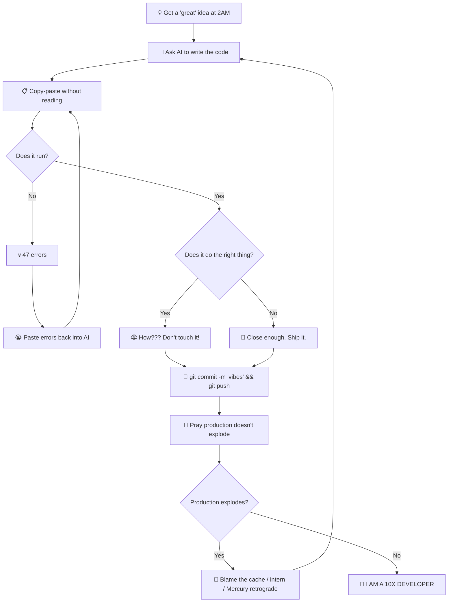

<!-- ██╗  ██╗ █████╗ ███╗   ███╗███████╗ █████╗ -->
<!-- ██║  ██║██╔══██╗████╗ ████║╚══███╔╝██╔══██╗ -->
<!-- ███████║███████║██╔████╔██║  ███╔╝ ███████║ -->
<!-- ██╔══██║██╔══██║██║╚██╔╝██║ ███╔╝  ██╔══██║ -->
<!-- ██║  ██║██║  ██║██║ ╚═╝ ██║███████╗██║  ██║ -->
<!-- ╚═╝  ╚═╝╚═╝  ╚═╝╚═╝     ╚═╝╚══════╝╚═╝  ╚═╝ -->

<!-- ═══════════════════════════════════════════ -->
<!--                   HEADER                   -->
<!-- ═══════════════════════════════════════════ -->

<div align="center">

<!-- Main hero banner -->


</div>

<!-- ═══════════════════════════════════════════ -->
<!--               TYPING ANIMATION             -->
<!-- ═══════════════════════════════════════════ -->

<div align="center">
  <a href="https://git.io/typing-svg">
    
  </a>
</div>

<br/>

<!-- ═══════════════════════════════════════════ -->
<!--                   BADGES                   -->
<!-- ═══════════════════════════════════════════ -->

<div align="center">
  
  &nbsp;
  <a href="https://github.com/Hamza-op?tab=followers">
    
  </a>
  &nbsp;
  
  &nbsp;
  
</div>

<br/>


<!-- ═══════════════════════════════════════════ -->
<!--                 ABOUT ME                   -->
<!-- ═══════════════════════════════════════════ -->

<table width="100%" align="center">
<tr>
<td width="55%" valign="top">

## 🧬 System Info

```typescript
const hamza: Developer = {
  name:        "Hamza",
  alias:       "Hamza-op",
  pronouns:    "he/him",
  location:    "Somewhere with > 5G WiFi 📶",
  education:   "YouTube University + Stack Overflow PhD 🎓",

  currentlyBuilding: [
    "Discord Bots that actually work 🤖",
    "Web Apps powered by vibes ✨",
    "Tools that do things™️",
  ],

  techStack: {
    languages:   ["TypeScript", "JavaScript", "Python", "C++"],
    frontend:    ["React", "Next.js", "TailwindCSS"],
    backend:     ["Node.js", "Express", "Convex"],
    database:    ["MongoDB", "PostgreSQL"],
    devOps:      ["Docker", "Vercel", "Git"],
    ai_tools:    ["ChatGPT", "Claude", "Cursor", "Copilot"],
  },

  debugStrategy:  "console.log('HERE???')",
  commitMessage:  "git commit -m 'fixed stuff idk'",
  superpower:     "Making things work without knowing why",
  motto:          "It compiled → Ship it 🚀",
};
```

</td>
<td width="45%" valign="top" align="center">

## ⚡ Real Talk

<br/>

🤖 My code is **AI-assisted** & I'm **proud** of it  
🎯 I don't debug — I **negotiate with compilers**  
📚 Docs? I write **vibes, not wikis**  
🔥 `git push --force` is a **valid strategy**  
💀 I ship bugs **for free** as a bonus feature  
🙏 My code works & **nobody knows why**  
☕ Powered by **caffeine** and **divine prompts**  
🌙 Best commits happen at **3AM**  
🧠 **Brain.exe** has stopped responding  
🚀 If in doubt, **Ctrl+Z** and blame the intern  

<br/>


</td>
</tr>
</table>


<!-- ═══════════════════════════════════════════ -->
<!--               GITHUB OVERVIEW              -->
<!-- ═══════════════════════════════════════════ -->

<h2 align="center">📊 GitHub Overview</h2>

<div align="center">
  
</div>

<br/>


<!-- ═══════════════════════════════════════════ -->
<!--                TECH STACK                  -->
<!-- ═══════════════════════════════════════════ -->

<h2 align="center">🧰 Arsenal</h2>

<div align="center">

### 🤖 The Real MVPs (Senior Devs)


### 💻 Languages


### 🎨 Frontend


### ⚙️ Backend & Database


### 🛠️ Tools & DevOps


</div>


<!-- ═══════════════════════════════════════════ -->
<!--              SKILLS BREAKDOWN              -->
<!-- ═══════════════════════════════════════════ -->

<h2 align="center">📊 Skill Breakdown (Certified Honest)</h2>

<div align="center">

```
╔══════════════════════════════════════════════════════════════╗
║              HAMZA'S SKILL ANALYTICS  v2.0.26               ║
╠══════════════════════════════════════════════════════════════╣
║  Prompt Engineering    ████████████████████  99%  🔥 GODLIKE ║
║  Googling Errors       ███████████████████░  96%  🔥 GODLIKE ║
║  Copy-Pasting          ██████████████████░░  92%  ⚡ EXPERT  ║
║  Blaming the Cache     █████████████████░░░  88%  ⚡ EXPERT  ║
║  Vibing at Keyboard    ████████████████░░░░  82%  ⚡ EXPERT  ║
║  TypeScript            ███████████████░░░░░  75%  ✅ SKILLED ║
║  React / Next.js       ██████████████░░░░░░  70%  ✅ SKILLED ║
║  Node.js / Backend     █████████████░░░░░░░  65%  ✅ SKILLED ║
║  Reading Docs          ███░░░░░░░░░░░░░░░░░  18%  📖 TRYING  ║
║  Understanding Code    ██░░░░░░░░░░░░░░░░░░  10%  🐣 JUNIOR  ║
║  Writing Tests         ░░░░░░░░░░░░░░░░░░░░   0%  💀 EXTINCT ║
╚══════════════════════════════════════════════════════════════╝
```

</div>


<!-- ═══════════════════════════════════════════ -->
<!--                GITHUB STATS                -->
<!-- ═══════════════════════════════════════════ -->

<h2 align="center">📈 GitHub Stats (Real Numbers, Real Pain)</h2>

<div align="center">
  
  
</div>

<br/>


<!-- ═══════════════════════════════════════════ -->
<!--              CONTRIBUTION GRAPH            -->
<!-- ═══════════════════════════════════════════ -->

<h2 align="center">🌊 Contribution Waves</h2>

<div align="center">
  
</div>

<br/>

<!-- ═══════════════════════════════════════════ -->
<!--            SNAKE CONTRIBUTION              -->
<!-- ═══════════════════════════════════════════ -->

<div align="center">
  <h3>🐍 Snake eating my contributions</h3>
  <picture>
    <source media="(prefers-color-scheme: dark)" srcset="https://raw.githubusercontent.com/Hamza-op/Hamza-op/output/github-snake-dark.svg" />
    <source media="(prefers-color-scheme: light)" srcset="https://raw.githubusercontent.com/Hamza-op/Hamza-op/output/github-snake.svg" />
    
  </picture>
</div>


<!-- ═══════════════════════════════════════════ -->
<!--              MY GIT WORKFLOW               -->
<!-- ═══════════════════════════════════════════ -->

<h2 align="center">🔄 The Sacred Git Workflow™</h2>

<div align="center">



</div>


<!-- ═══════════════════════════════════════════ -->
<!--             WEEKLY DEV STATS               -->
<!-- ═══════════════════════════════════════════ -->

<h2 align="center">⏱️ This Week I Spent Time On</h2>

<div align="center">

```text
TypeScript   ████████████░░░░░░░░   48.3%
JavaScript   ████████░░░░░░░░░░░░   30.7%
Python       ███░░░░░░░░░░░░░░░░░   12.1%
C++          ██░░░░░░░░░░░░░░░░░░    6.4%
Markdown     █░░░░░░░░░░░░░░░░░░░    2.5%
```

> *Powered by vibes and approximations since WakaTime is too much setup*

</div>


<!-- ═══════════════════════════════════════════ -->
<!--              RANDOM EXTRAS                 -->
<!-- ═══════════════════════════════════════════ -->

<h2 align="center">🎲 Random Dev Wisdom</h2>

<div align="center">
  
</div>

<br/>

<div align="center">
  
</div>


<!-- ═══════════════════════════════════════════ -->
<!--               CONNECT WITH ME              -->
<!-- ═══════════════════════════════════════════ -->

<h2 align="center">🌐 Find Me in the Wild</h2>

<div align="center">
  <a href="mailto:hamza1790269@gmail.com">
    
  </a>
  &nbsp;
  <a href="https://github.com/Hamza-op">
    
  </a>
  &nbsp;
  <a href="https://discord.com/users/492541948201271306">
    
  </a>
</div>

<br/>

<div align="center">
  
</div>

<br/>

<!-- ═══════════════════════════════════════════ -->
<!--                 DISCLAIMER                 -->
<!-- ═══════════════════════════════════════════ -->

<div align="center">

> ⚡ **PSA:** Yes, 90% of my code is AI-assisted. Welcome to 2026. The other 10% is Stack Overflow.  
> The real skill? **Knowing what to ask.** And I'm very, very good at that. 😎

</div>

<br/>

<!-- ═══════════════════════════════════════════ -->
<!--                   FOOTER                   -->
<!-- ═══════════════════════════════════════════ -->

<div align="center">
  
</div>

<!-- ═══════════════════════════════════════════════════════════════════ -->
<!-- NOTE TO SELF: Remember to set up the snake GitHub Action!         -->
<!-- Go to Settings → Actions → Workflows → Create snake.yml           -->
<!-- https://github.com/Platane/snk                                    -->
<!-- ═══════════════════════════════════════════════════════════════════ -->
