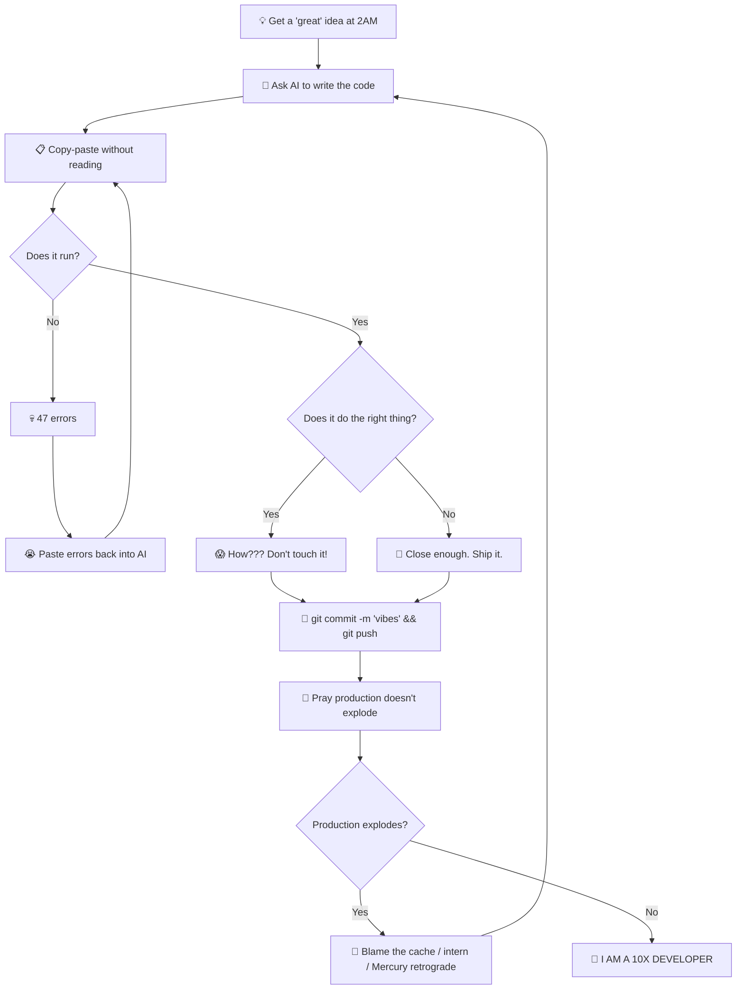

<!-- ═══════════════════════════════════════════ -->
<!--                   HEADER                   -->
<!-- ═══════════════════════════════════════════ -->

<div align="center">

<!-- Cyberpunk Twinkling Neon Banner -->


</div>

<!-- ═══════════════════════════════════════════ -->
<!--               TYPING ANIMATION             -->
<!-- ═══════════════════════════════════════════ -->

<div align="center">
  
</div>

<br/>

<!-- ═══════════════════════════════════════════ -->
<!--                   BADGES                   -->
<!-- ═══════════════════════════════════════════ -->

<div align="center">
  
  &nbsp;
  <a href="https://github.com/Hamza-op?tab=followers">
    
  </a>
  &nbsp;
  <!-- LOC_BADGE_START --><!-- LOC_BADGE_END -->
  &nbsp;
  
</div>

<br/>

<hr style="border: 0; border-top: 1px solid #334155;" />

<!-- ═══════════════════════════════════════════ -->
<!--                 ABOUT ME                   -->
<!-- ═══════════════════════════════════════════ -->

<table width="100%" align="center">
<tr>
<td width="55%" valign="top">

### 🧬 System Diagnostic
```typescript
const hamza: Developer = {
  role:        "Systems & Full-Stack",
  languages:   ["Rust", "TypeScript", "Python", "C++"],
  superpower:  "Turning caffeine into binary ☕",
  philosophy:  "Type safety > Runtime prayers 🙏",
  debugMethod: "console.log('here???') // in prod",
  gitStrategy: "git push --force --no-verify 🚀",
  metrics:     "48,691 LOC of production code live",
  status:      "Manifesting scalable codebases ✨"
};
```

</td>
<td width="45%" valign="top">

### ⚡ Real Talk / System Log
<br/>

🤖 My code is **AI-assisted** & I'm **proud** of it  
🎯 I don't debug — I **negotiate with compilers**  
📚 Docs? I write **self-documenting clean code**  
🔥 Stack Overflow is my **backup brain**  
☕ Powered by **caffeine** and **divine prompts**  
🌙 Best commits happen at **3 AM**  
🧠 **Brain.exe** runs on infinite recursive loops  

</td>
</tr>
</table>

<hr style="border: 0; border-top: 1px solid #334155;" />

<!-- ═══════════════════════════════════════════ -->
<!--                TECH STACK                  -->
<!-- ═══════════════════════════════════════════ -->

## 🧰 Technical Arsenal

<div align="center">

### 💻 Languages


### 🎨 Frontend Frameworks


### ⚙️ Backend & Database


### 🛠️ Infrastructure & Tools


</div>

<hr style="border: 0; border-top: 1px solid #334155;" />

<!-- ═══════════════════════════════════════════ -->
<!--             FEATURED PROJECTS              -->
<!-- ═══════════════════════════════════════════ -->

## 📂 Open-Source Project Portfolio

<!-- METRICS_BOARD_START -->
<div align="center">
  <table border="0" cellspacing="0" cellpadding="10">
    <tr>
      <td>💻 <strong>Total Source Lines of Code:</strong> <code>48,691</code></td>
      <td>🦀 <strong>Systems Code (Rust):</strong> <code>26,909 LOC (55.3%)</code></td>
      <td>📂 <strong>Indexed Repositories:</strong> <code>11</code></td>
    </tr>
  </table>
</div>
<!-- METRICS_BOARD_END -->

<br/>

A complete index of my software engineering projects, categorized by technical focus, systems utility, and architecture:

### 🦀 Systems & High-Performance Utilities (Rust)

<table width="100%" border="0" cellspacing="5" cellpadding="5">
  <thead>
    <tr>
      <th width="35%" align="left">Repository</th>
      <th width="15%" align="left">Stack</th>
      <th width="50%" align="left">Description</th>
    </tr>
  </thead>
  <tbody>
    <tr>
      <td><strong><a href="https://github.com/Hamza-op/ZeroIdle">ZeroIdle</a></strong></td>
      <td><code>Rust</code> <code>Systems</code></td>
      <td>A lightweight, high-performance background utility written in Rust designed to prevent systems from entering idle states, optimized for minimal resource footprints.</td>
    </tr>
    <tr>
      <td><strong><a href="https://github.com/Hamza-op/universal-file-converter">universal-file-converter</a></strong></td>
      <td><code>Rust</code> <code>CLI</code></td>
      <td>A blazingly fast local command-line conversion utility. Utilizes multithreading and safe concurrency to perform rapid file format conversions offline.</td>
    </tr>
    <tr>
      <td><strong><a href="https://github.com/Hamza-op/beat-detect-cep">beat-detect-cep</a></strong></td>
      <td><code>Rust</code> <code>Audio</code></td>
      <td>A high-performance audio analysis and beat detection library integrated directly into Adobe CEP panels.</td>
    </tr>
    <tr>
      <td><strong><a href="https://github.com/Hamza-op/Meta-data-extractor">Meta-data-extractor</a></strong></td>
      <td><code>Rust</code> <code>Parser</code></td>
      <td>A secure, safe binary parser designed to parse, extract, and index rich metadata from varied image and document structures.</td>
    </tr>
    <tr>
      <td><strong><a href="https://github.com/Hamza-op/GimbalScout">GimbalScout</a></strong></td>
      <td><code>Rust</code> <code>Tracking</code></td>
      <td>A fast systems integration tool engineered to handle camera gimbal positioning and scout controller signals.</td>
    </tr>
    <tr>
      <td><strong><a href="https://github.com/Hamza-op/fasttrack">fasttrack</a></strong></td>
      <td><code>Rust</code> <code>Benchmark</code></td>
      <td>A benchmarking engine designed to measure execution speed and microsecond latency across system-level hot paths.</td>
    </tr>
  </tbody>
</table>

### 🌐 Web Applications & Full-Stack (TypeScript)

<table width="100%" border="0" cellspacing="5" cellpadding="5">
  <thead>
    <tr>
      <th width="35%" align="left">Repository</th>
      <th width="15%" align="left">Stack</th>
      <th width="50%" align="left">Description</th>
    </tr>
  </thead>
  <tbody>
    <tr>
      <td><strong><a href="https://github.com/Hamza-op/click-khareed">click-khareed</a></strong></td>
      <td><code>Next.js</code> <code>Tailwind</code></td>
      <td>A high-fidelity, responsive full-stack e-commerce marketplace featuring lightning-fast catalog search, dynamic carts, and custom checkout flows.</td>
    </tr>
    <tr>
      <td><strong><a href="https://github.com/Hamza-op/memory-coloring">memory-coloring</a></strong></td>
      <td><code>React</code> <code>TypeScript</code></td>
      <td>An interactive visual platform designed to represent dynamic memory structures, coloring allocations, and memory manipulation strategies.</td>
    </tr>
    <tr>
      <td><strong><a href="https://github.com/Hamza-op/moonfilmwork">moonfilmwork</a></strong></td>
      <td><code>Vite</code> <code>TypeScript</code></td>
      <td>A premium portfolio platform custom-built for creative film production showcases, media distribution, and high-fidelity video embeddings.</td>
    </tr>
  </tbody>
</table>

### ⚙️ Automation, Shell & Simulation (Shell / Python)

<table width="100%" border="0" cellspacing="5" cellpadding="5">
  <thead>
    <tr>
      <th width="35%" align="left">Repository</th>
      <th width="15%" align="left">Stack</th>
      <th width="50%" align="left">Description</th>
    </tr>
  </thead>
  <tbody>
    <tr>
      <td><strong><a href="https://github.com/Hamza-op/BuildWSA">BuildWSA</a></strong></td>
      <td><code>Shell</code> <code>Android</code></td>
      <td>An automated build integration tool designed to compile Windows Subsystem for Android™ with Google Play Store, Magisk root, and Xposed framework pre-installed.</td>
    </tr>
    <tr>
      <td><strong><a href="https://github.com/Hamza-op/HTML-to-Office-Converter">HTML-to-Office-Converter</a></strong></td>
      <td><code>Python</code> <code>Parser</code></td>
      <td>A local document conversion parser that processes rich HTML markup and converts it seamlessly to standard Microsoft Office formats (.docx, .xlsx).</td>
    </tr>
    <tr>
      <td><strong><a href="https://github.com/Hamza-op/food-garden">food-garden</a></strong></td>
      <td><code>Python</code> <code>Simulation</code></td>
      <td>An agricultural layout planning and simulation tool built to model resource allocation and localized irrigation garden grids.</td>
    </tr>
  </tbody>
</table>

<hr style="border: 0; border-top: 1px solid #334155;" />

<!-- ═══════════════════════════════════════════ -->
<!--              SKILLS BREAKDOWN              -->
<!-- ═══════════════════════════════════════════ -->

## 📊 Skill Distribution Matrix

```text
╔══════════════════════════════════════════════════════════════╗
║              CORE COMPETENCY DISTRIBUTION                    ║
╠══════════════════════════════════════════════════════════════╣
║  Systems Programming (Rust)   ██████████████████░░░░  80%    ║
║  Full-Stack Dev (TS / Next.js)████████████████░░░░░░  75%    ║
║  Scripting & Tooling (Python)  ████████████░░░░░░░░░░  60%    ║
║  Database Design (Postgres/DB) ██████████░░░░░░░░░░░░  50%    ║
║  DevOps & Containerization     ████████░░░░░░░░░░░░░░  40%    ║
╚══════════════════════════════════════════════════════════════╝
```

<hr style="border: 0; border-top: 1px solid #334155;" />

<!-- ═══════════════════════════════════════════ -->
<!--              MY GIT WORKFLOW               -->
<!-- ═══════════════════════════════════════════ -->

<h2 align="center">🔄 The Sacred Git Workflow™</h2>

<div align="center">


```mermaid
flowchart TD
    A[💡 Get a 'great' idea at 2AM] --> B[🤖 Ask AI to write the code]
    B --> C[📋 Copy-paste without reading]
    C --> D{Does it run?}
    D -- No --> E[💀 47 errors]
    E --> F[😭 Paste errors back into AI]
    F --> C
    D -- Yes --> G{Does it do the right thing?}
    G -- No --> H[🤷 Close enough. Ship it.]
    G -- Yes --> I[😱 How??? Don't touch it!]
    I --> J[🚀 git commit -m 'vibes' && git push]
    H --> J
    J --> K[🙏 Pray production doesn't explode]
    K --> L{Production explodes?}
    L -- Yes --> M[😤 Blame the cache / intern / Mercury retrograde]
    M --> B
    L -- No --> N[🎉 I AM A 10X DEVELOPER]
```

</div>

<hr style="border: 0; border-top: 1px solid #334155;" />

<!-- ═══════════════════════════════════════════ -->
<!--                GITHUB STATS                -->
<!-- ═══════════════════════════════════════════ -->

## 📈 GitHub Performance Insights

<div align="center">
  <table border="0" cellspacing="0" cellpadding="0">
    <tr>
      <td>
        
      </td>
      <td>
        
      </td>
    </tr>
  </table>
</div>

<br/>

<!-- ═══════════════════════════════════════════ -->
<!--              CONTRIBUTION GRAPH            -->
<!-- ═══════════════════════════════════════════ -->

<div align="center">
  
</div>

<br/>

<!-- ═══════════════════════════════════════════ -->
<!--            SNAKE CONTRIBUTION              -->
<!-- ═══════════════════════════════════════════ -->

<div align="center">
  <picture>
    <source media="(prefers-color-scheme: dark)" srcset="https://raw.githubusercontent.com/Hamza-op/Hamza-op/output/github-snake-dark.svg" />
    <source media="(prefers-color-scheme: light)" srcset="https://raw.githubusercontent.com/Hamza-op/Hamza-op/output/github-snake.svg" />
    
  </picture>
</div>

<hr style="border: 0; border-top: 1px solid #334155;" />

<!-- ═══════════════════════════════════════════ -->
<!--              RANDOM EXTRAS                 -->
<!-- ═══════════════════════════════════════════ -->

<div align="center">
  <table border="0" cellspacing="0" cellpadding="0" width="100%">
    <tr>
      <td width="50%" align="center">
        
      </td>
      <td width="50%" align="center">
        
      </td>
    </tr>
  </table>
</div>

<br/>

<!-- ═══════════════════════════════════════════ -->
<!--               CONNECT WITH ME              -->
<!-- ═══════════════════════════════════════════ -->

<h2 align="center">🌐 Connect & Collaborate</h2>

<div align="center">
  <a href="mailto:hamza1790269@gmail.com">
    
  </a>
  &nbsp;
  <a href="https://github.com/Hamza-op">
    
  </a>
  &nbsp;
  <a href="https://discord.com/users/492541948201271306">
    
  </a>
</div>

<br/>
